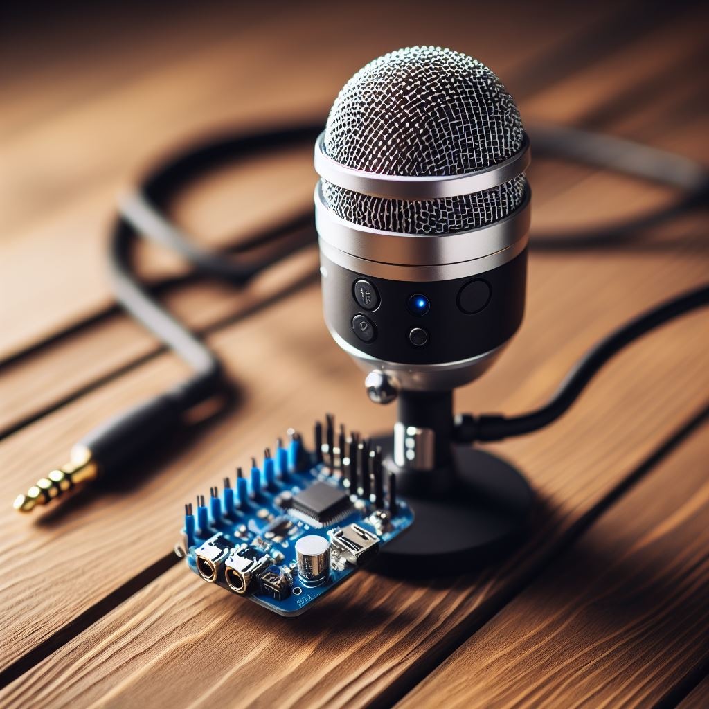

<h1 align="center">
    
</h1>

# Real-Time I2S Microphone to Bluetooth Project

<strong>English 🇺🇸</strong>
 
[Portguese 🇧🇷](./README.md) 

## Overview

This project is a real-time audio streaming application that reads data from an I2S microphone and sends it to a Bluetooth device using the Espressif IoT Development Framework (ESP-IDF) version 5.1.1.

## Context

This project was developed for of Real Time Systems course in the Computer Engineering program at the Federal University of Recôncavo da Bahia.

## Bluetooth Configuration

Before you start, ensure that you have installed the ESP-IDF tools, set the target device, and configured your project by modifying the `preferences.h` file according to your specific hardware and preferences.

### Bluetooth Configuration

- `TARGET_DEVICE_NAME`: Set the name of the target Bluetooth device.
- `LOCAL_DEVICE_NAME`: Set the name of your ESP device as it will appear to other devices.

### I2S Configuration

- `WS_IO_PORT`: Set the GPIO pin for the Word Select (WS) signal of the I2S microphone.
- `SD_PORT`: Set the GPIO pin for the Serial Data (SD) signal.
- `SCK_PORT`: Set the GPIO pin for the Serial Clock (SCK) signal.
- `I2S_NUM`: Set the I2S port number (usually I2S_NUM_0 for most ESP32 boards).

### I2S Audio Configuration

- `FRAME_RATE`: Set the frame rate for audio data.
- `N_WINDOW_ELEMENTS`: Set the number of window elements for audio processing.

### Queue Configuration

- `MAX_SIZE_QUEUE`: Set the maximum size of the queue for buffering audio data.

## Building and Flashing

To build and flash the project to your ESP32 device, follow the standard ESP-IDF build process. Make sure to have set the IDF_PATH and target device using `idf.py set-target` and `idf.py set-idf-path` commands. You can refer to the [ESP-IDF documentation](https://docs.espressif.com/projects/esp-idf/en/v5.1.1/get-started/index.html) for detailed instructions.

## Usage

Once the project is flashed onto your ESP32 device, it will read audio data from the I2S microphone and transmit it to the specified Bluetooth device with the configured names.

## Contact

If you have any questions or would like to contribute to this project, please reach out to the contributors.

- Andersoney Rodrigues
 Email: andresoney@gmail.com
 github.com/andersoney

- Filipe Correia
 Email: f7lipe@aluno.ufrb.edu.br
 github.com/f7lipe

- Igor Miranda
 Email: igordantas@ufrb.edu.br
 github.com/igordsm83

- Paulo Cesar
 Email:  paulo.rocha@aluno.ufrb.edu.br
 github.com/paul0Cesar
